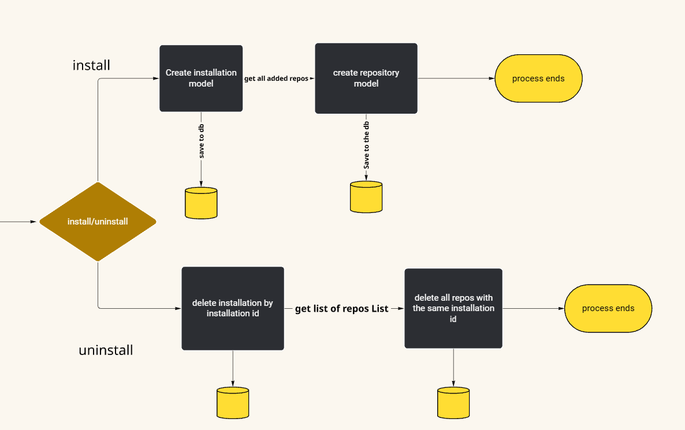
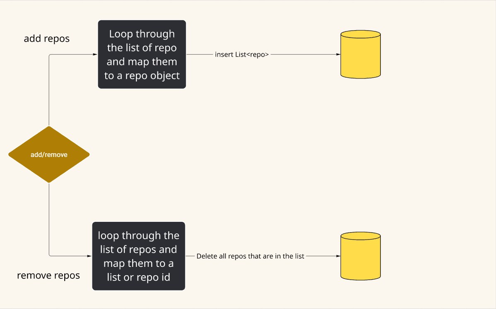
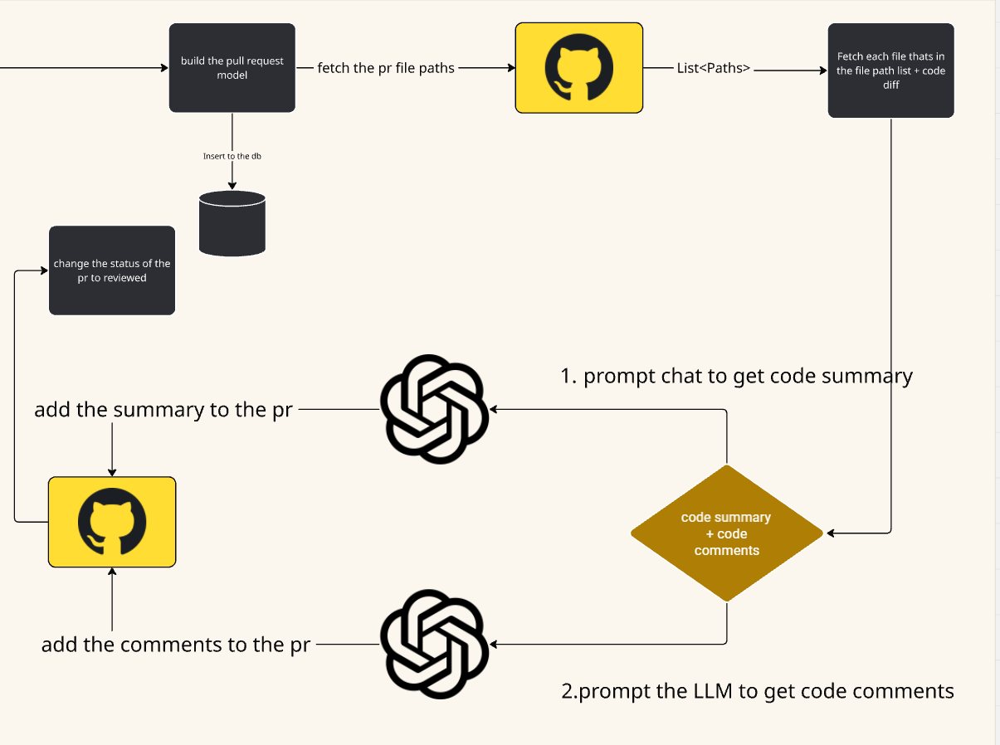

# CleanPR


## Project overview

CleanPR speeds up and standardizes code reviews for GitHub pull requests by using a GitHub App backend that automatically generates professional PR summaries and inline comments using an LLM.

Problem solved:

- Manual PR reviews are time-consuming and inconsistent across reviewers.

Solution in one line:

- When a pull request is opened, CleanPR fetches the PR's patch and file contents, sends them to an AI model with structured system prompts, then posts a concise, professional summary and line-level comments back to the GitHub PR as a review.

Why it helps:

- Faster feedback loop for authors
- More consistent and focused reviews
- Keeps a record of review status in a database for later inspection

## View the project

### View the project live
[Some link here when the project is deployed](https://www.google.com)

### View the project locally

1. Clone the repo
```bash
git clone <repo-url>
```

2. Open the backend folder in your favorite IDE and add a secret file in the resources folder

naming convention: application-secrets.yml 

```yaml
gitHubClientId: {clientId}
gitHubClientSecret: {clientSecret}
jwtSecret: {jwtSecret}

postgres:
  url: {db_url}
  name: {db_username}
  password: {db_password}

openai:
  api-key: {your openAi apikey}
```

3. Make sure postgreSQL is running locally

4. Run the backend

```bash
mvn spring-boot:run 

or if you have intelliJ click the run button
```

5. Run the frontend 

    Make sure you are in the frontend directory

```bash
npm install

npm start
```


## Integration with GitHub
This project connects to GitHub via a GitHub App. Below is a condensed integration guide with quick references and visuals.

### Quick settings

| Item | Value / where to set |
|---|---|
| Webhook URL | `https://<your-backend>/api/v1/webhook/github` (`GitHubWebhooks.java`) |
| Required events | `pull_request`, `installation`, `repository` |
| Minimum permissions | Pull requests (Read & Write), Contents (Read), Metadata (Read) |
| App config | set `github.key` (private key path) and `github.appId` in `application.yml` |

### Frontend integration overview

The frontend provides the user-facing flows to authenticate and install the GitHub App:

- Login: users sign in with GitHub OAuth. The Login button redirects to the backend OAuth endpoint:
    `GET /oauth2/authorization/github` (see `frontend/src/components/Auth/Auth.jsx`). The backend handles the OAuth callback and sets the user session/profile that the frontend stores in localStorage (`AuthContext.jsx`).
- Install (Add repo): from the Repositories dashboard the user clicks Add Repo which redirects to the GitHub App install URL:
    `https://github.com/apps/clean-pr/installations/new?target_id={userId}`. After installation GitHub will send `installation` webhook events to your backend which will populate the repo list the dashboard fetches.
- Manage repos: the frontend uses API endpoints (e.g., `GET /api/v1/repository/user/{userId}`, `DELETE /api/v1/repository/{repoId}/installation/{installationId}`) to reflect installed repositories and to remove records when the user requests it.

In short: user logs in via GitHub OAuth → user clicks Add Repo to install the App → GitHub sends installation webhooks → backend saves repos → frontend lists them and navigates to PRs.

### Frontend actions (dashboard)

| Action | Frontend file | Backend endpoint |
|---|---:|---|
| Install / Add repo | `Repositories.jsx` (handleAddRepository) | GitHub App install URL: `https://github.com/apps/clean-pr/installations/new?target_id={userId}` |
| Remove repo | `Repositories.jsx` (handleRemoveRepository) | `DELETE /api/v1/repository/{repoId}/installation/{installationId}` |
| View PRs | `RepoListItem.jsx` | `GET /api/v1/pull-requests/repository/{repoId}` |

### Handlers at a glance

| GitHub action | Handler | Purpose |
|---|---|---|
| `installation.created` / `deleted` | `InstallationEventHandler` | Save/delete installation and repo records |
| `repository.added` / `removed` | `RepoEventHandler` | Add/remove repo records and cleanup PRs |
| `pull_request.opened` | `PullRequestHandler` | Fetch files → call LLM → post review → update DB |

Refer to the files listed above for the full logic (see `backend/src/main/java/com/fahd/cleanPR/handler/`).

## Event handling flow (detailed)

### Event handling flow (compact)

Below is a concise mapping and a visual flow to show what happens after GitHub sends an event.

| GitHub action | Handler | Key steps |
|---|---|---|
| `installation.created` | `InstallationEventHandler` | save Installation + initial Repos (uses `installation.access_tokens_url`) |
| `installation.deleted` | `InstallationEventHandler` | delete Installation, Repos, PRs |
| `repository.added` / `removed` | `RepoEventHandler` | add/remove Repo records; cleanup PRs on remove |
| `pull_request.opened` | `PullRequestHandler` | save PR → get token → fetch files & patches → call OpenAI → post review → mark REVIEWED |
| `pull_request.closed` | `PullRequestHandler` | set CLOSED or MERGED and save timestamps |


Quick payload fields & DB effects

| Event | Important payload fields | DB effect |
|---|---|---|
| installation.created | `installation.id`, `access_tokens_url`, `repositories[]` | insert Installation, insert Repos |
| repository.removed | `repositories_removed[]` | delete Repo(s), delete PRs for repo |
| pull_request.opened | `number`, `pull_request.id`, `pull_request.head.repo`, `pull_request.created_at` | insert PullRequest (status=OPEN) |

Short test checklist

- Install the app from the dashboard and confirm an Installation row and Repo rows are created.
- Open a PR in an installed repo and confirm a review comment appears and the DB PR row becomes `REVIEWED`.

Security & reliability (short)

- Add webhook signature verification (X-Hub-Signature-256).
- Store secrets outside VCS and add retry/backoff for external calls.

For full implementation details, see the handler files under `backend/src/main/java/com/fahd/cleanPR/handler/`.

## Installation Event handling diagram



## Add/Remove Repo Event handling diagram



## Pull Request Event handling diagram



## Data models (Java classes)

Below are the main JPA data model classes used by the backend. Each block shows the model in Java form and a short description of its purpose.

Installation — stores GitHub App installation metadata (installation id, owner user id, access token URL):

```java
package com.fahd.cleanPR.model;

import jakarta.persistence.Column;
import jakarta.persistence.Entity;
import jakarta.persistence.Id;
import jakarta.persistence.Table;
import lombok.AllArgsConstructor;
import lombok.Builder;
import lombok.Data;
import lombok.NoArgsConstructor;

@AllArgsConstructor
@NoArgsConstructor
@Builder
@Entity
@Data
@Table(name = "installation")
public class Installation {

    @Id
    int installationId;

    @Column
    int userId;

    @Column
    String accessTokenUrl;
}
```

Repo — represents a repository installed by the App (id, owner, installation id, name, privacy):

```java
package com.fahd.cleanPR.model;

import jakarta.persistence.*;
import lombok.AllArgsConstructor;
import lombok.Builder;
import lombok.Data;
import lombok.NoArgsConstructor;

@Data
@NoArgsConstructor
@AllArgsConstructor
@Builder
@Entity
public class Repo {

    @Id
    int repoId;

    @Column
    int userId;

    @Column
    int installationId;

    @Column
    String repoName;

    @Column
    boolean isPrivate;
}
```

PullRequest — main PR record tracked by CleanPR (ids, status, timestamps, urls):

```java
package com.fahd.cleanPR.model;

import jakarta.persistence.*;
import lombok.AllArgsConstructor;
import lombok.Builder;
import lombok.Data;
import lombok.NoArgsConstructor;
import java.time.OffsetDateTime;

@Data
@Builder
@NoArgsConstructor
@AllArgsConstructor
@Entity
public class PullRequest {

    @Id
    @Column
    private long Id;

    @Column
    private String title;

    @Column
    private int repoOwnerId;

    @Column
    private int authorId;

    @Column
    private String authorName;

    @Column
    private int repoId;

    @Column
    private int installationId;

    @Enumerated(EnumType.STRING)
    @Column
    private Status status;

    @Column
    @Temporal(TemporalType.TIMESTAMP)
    private OffsetDateTime openedAt;

    @Column
    private OffsetDateTime reviewedAt;

    @Column
    private OffsetDateTime closedAt;

    @Column
    private String url;
}
```

Profile — basic user profile stored in the app (user id, login, avatar):

```java
package com.fahd.cleanPR.model;

import jakarta.persistence.*;
import lombok.*;

@Entity
@Builder
@Getter
@Setter
@AllArgsConstructor
@NoArgsConstructor
public class Profile {

    @Id
    @Column
    private int userId;
    @Column
    private String login;
    @Column
    private String avatarUrl;

}
```

Account — stores account details (user id, login, email):

```java
package com.fahd.cleanPR.model;

import jakarta.persistence.Column;
import jakarta.persistence.Entity;
import jakarta.persistence.Id;
import lombok.*;

@Builder
@AllArgsConstructor
@NoArgsConstructor
@Getter
@Setter
@Entity
public class Account {

    @Id
    @Column
    private int userId;
    @Column
    private String userLogin;
    @Column
    private String email;
}
```

Status — PR lifecycle states used by `PullRequest.status`:

```java
package com.fahd.cleanPR.model;

public enum Status {
    OPEN,
    CLOSED,
    MERGED,
    REVIEWED,
}
```


